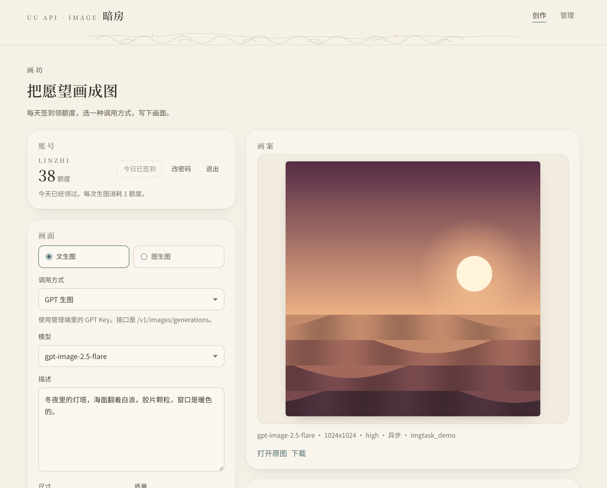
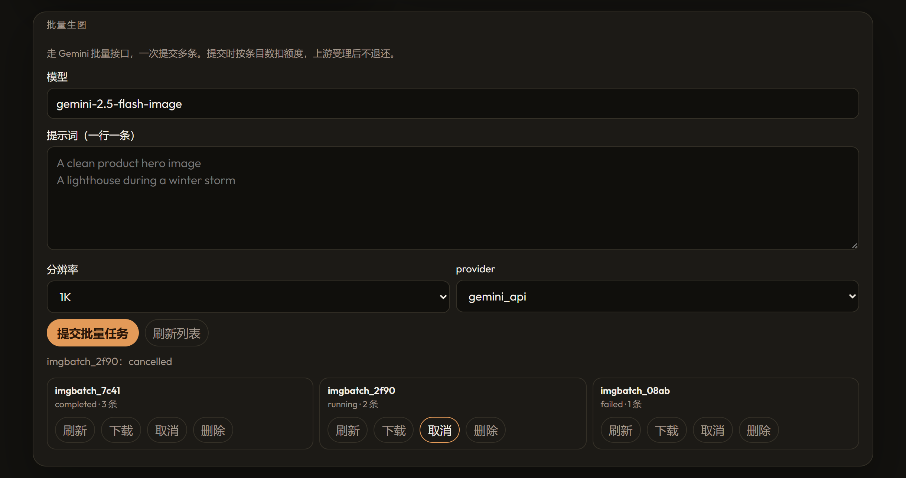
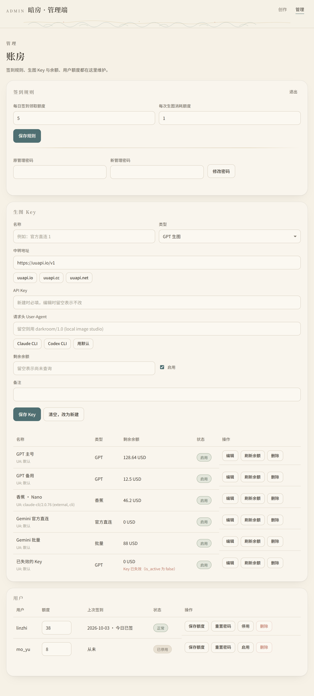
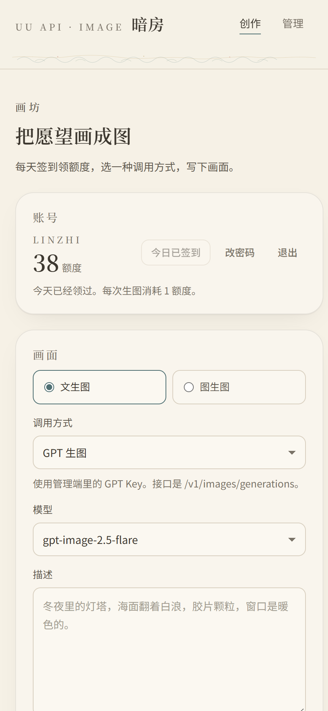

# 暗房 · GPT / Gemini 生图工作台

一个跑在本机的生图工作台。Node 起一个服务，浏览器打开就能用：用户注册登录、每天签到领额度、
消耗额度生图；管理员在管理端维护中转站（UU API）的 Key 和余额，服务端按调用方式自动挑一把
还有余额的 Key 去请求上游。

前端是原生 HTML / CSS / JS，没有构建步骤，整个项目也没有第三方依赖。页面风格沿用「飞天」那套
纸底墨字的样式：Noto Serif SC 标题、青绿点缀、云纹分隔。



## 能做什么

四种调用方式，覆盖中转站上常见的几条生图链路：

- **GPT 生图** —— `POST /v1/images/generations`，图生图走 `/v1/images/edits`。
  先试异步接口再轮询 `/v1/images/tasks/{task_id}`；异步接口不存在时降级到同步接口，
  同步接口也不认时改走 `/v1/chat/completions` 对话生图。
- **Nano Banana 香蕉生图** —— 同一套生图接口，模型换成 `gemini-2.5-flash-image`、
  `gemini-3-pro-image` 等；生图接口不收这个模型时自动改走对话生图。
- **GEMINI官方直连-带生图** —— `POST /v1beta/models/{model}:generateContent`，正文是 Gemini
  官方格式，画幅和分辨率放在 `generationConfig.imageConfig`，参考图以 `inlineData` 放进 `contents`。
- **Gemini 批量生图** —— `POST /v1/images/batches` 一次提交多条提示词，之后查任务、看条目、
  下载 ZIP、取消、删除。这一族接口在用户端有独立面板。

其余功能：

- 文生图 / 图生图，参考图可以上传（PNG、JPEG、WebP，小于 20MB），也可以填一个 https 图片地址。
- 图生图可以带**蒙版**，指定只重绘哪一块（Gemini 官方直连不支持蒙版）。
- 账号体系：注册登录、每天签到领额度、每次生图扣额度，生图失败自动把额度退回去；
  用户可以改自己的密码。
- Key 池：按调用方式分组，优先挑余额多的、最近没怎么用过的 Key；余额为 0、停用的、
  以及中转站报告已失效的 Key 都不会被选中。
- 每把 Key 可以单独配请求头 `User-Agent`，应付中转站的外接策略。
- 生成记录留在浏览器 localStorage 里（最近 16 条），服务端不存图片。

## 快速开始

需要 Node 18 或更高版本（前端那个静态服务用的就是它）。

前端和后端是两个独立的进程，分别起：

```bash
node web-server.js                # 前端静态服务，127.0.0.1:6664
cd server-go && go run .          # 后端，127.0.0.1:6670
```

然后打开 **http://127.0.0.1:6664** 。

管理端默认账号是 **`admin` / `admin@123`**，两个服务都只监听 `127.0.0.1`，不对外网开放。
登录后请到管理端把密码改掉。

想换账号密码就用环境变量，设了 `ADMIN_PASSWORD` 之后每次启动都会把管理端对齐到这个密码，
忘了密码时也能用它找回来：

```bash
ADMIN_USER=admin ADMIN_PASSWORD=your-password go run .
```

> **别用 6665–6669 这几个端口。** 那是 IRC 的保留段，Chrome 和 Edge 会直接拒绝连接
> （`ERR_UNSAFE_PORT`），curl 却一切正常，很容易查半天。前端默认 6664、后端默认 6670
> 就是为了避开这一段。

## 两个后端

`web/` 是纯静态前端，只认 `/api` 和 `/health`，所以后端有两套实现可以互换，前端一行都不用改：

|  | `server/`（Node） | `server-go/`（Go） |
| --- | --- | --- |
| 依赖 | 无，只用 Node 内置模块 | `modernc.org/sqlite`（纯 Go，不需要 CGO 和 gcc）、`golang.org/x/crypto` |
| 存储 | `data/store.json` | `data/darkroom.db`（SQLite） |
| 默认端口 | 3780 | 6670 |
| 启动 | `node server/server.js` | `cd server-go && go run .` |
| 同时托管前端 | 会（同源） | 会（同源，但默认走跨源那套） |

两套各自独立：数据文件不同、会话不互通，可以同时开着对比着用。

### 前后端分开跑

默认就是这么跑的：前端在 6664，后端在 6670，属于跨源。所以

- `web/config.js` 里把请求指向 `http://<当前主机名>:6670`；
- 后端必须回 CORS 头，而且因为登录态是 HttpOnly Cookie，`Access-Control-Allow-Origin`
  只能回具体来源、不能是 `*`，还要带 `Access-Control-Allow-Credentials`。
  两套后端都实现了，放行名单默认是 `http://127.0.0.1:6664` 和 `http://localhost:6664`，
  用 `CORS_ORIGINS` 可以改（逗号分隔）。

想把前后端合成同源（比如直接用后端托管 `web/`），把 `web/config.js` 里的
`window.DARKROOM_API` 改成空串即可，两个后端都会照常提供静态文件。

### 跑 Go 那套

需要 Go 1.26 或更高版本——路由本身 1.22 就够，但 `modernc.org/sqlite` 那一串依赖要求 1.26。

```bash
cd server-go
go run .          # 或者 go build -o darkroom.exe . && ./darkroom.exe
```

默认起在 6670，读写 `../data/darkroom.db`，管理端账号密码的默认值和 Node 版一致
（`admin` / `admin@123`，同样认 `ADMIN_USER` / `ADMIN_PASSWORD`）。

Go 版比 Node 版多几个环境变量：

| 环境变量 | 默认值 | 说明 |
| --- | --- | --- |
| `PORT` | `6670` | 监听端口 |
| `CORS_ORIGINS` | `http://127.0.0.1:6664,http://localhost:6664` | 放行哪些来源跨源访问 |
| `DATA_FILE` | `../data/darkroom.db` | SQLite 文件路径 |
| `WEB_DIR` | `../web` | 前端目录 |
| `RELAY_HOSTS` | uuapi 那四个域名 | 中转域名白名单，逗号分隔。只有自建中转或本地起桩测试才需要改；放开它等于允许把请求发到任意主机 |
| `RELAY_CA_FILE` | 无 | 额外信任的 CA 证书（PEM），用来接自签证书的中转站 |

## 上手顺序

1. 打开 http://127.0.0.1:3780/admin ，用 `admin` / `admin@123` 进入管理端。
2. 在「生图 Key」里加一把 Key：选类型，填中转地址和 API Key。GPT / 香蕉 / 批量填
   `https://uuapi.io/v1`，官方直连填 `https://uuapi.io`。保存后点「刷新余额」，确认能查到余额。
3. 回到 http://127.0.0.1:3780 ，注册一个账号，点「签到领额度」。
4. 选调用方式、模型，写好描述，点「生成」。

## 批量生图

一次提交多条提示词，走 Gemini 的批量任务合同，适合跑量。提交时按条目数扣额度
（每条 `output_count` 张算一次），上游受理之后就不再退还；提交本身失败会全额退回。



每个任务可以刷新状态、下载 ZIP、取消，或者删掉记录。下载和单项图片是原始字节透传，
不经过 JSON 包装。

## 管理端



- **签到规则**：每天签到领多少额度、每次生图扣多少额度。
- **生图 Key**：增删改查、启用停用、刷新余额、逐把 Key 配置请求头 `User-Agent`。
  中转地址只接受 `uuapi.io`、`uuapi.net`、`uuapi.shop`、`uuapi.cc` 四个域名下的 https 地址。
- **用户**：改额度、重置密码、停用 / 启用、删除。停用或重置密码会立刻踢掉该用户的所有会话。

### 余额是怎么查的

「刷新余额」只打一个接口：`GET {中转地址去掉 /v1}/v1/usage`，带 `Authorization: Bearer <API Key>`。
响应按下面这套规则解析，和把中转站导入 cc-switch 时用的 extractor 完全一致：

| 字段 | 取值 |
| --- | --- |
| 余额 | `remaining` → `quota.remaining` → `balance` |
| 单位 | `unit` → `quota.unit` → `USD` |
| 是否有效 | `is_active` → `isValid` → 默认有效 |

只有中转站返回了明确的布尔值才算数。一旦读到无效，这把 Key 会标红显示「Key 已失效」，
并且不再被挑去生图。

手机上是这样：



## 配置

| 环境变量 | 默认值 | 说明 |
| --- | --- | --- |
| `PORT` | `3780` | 监听端口 |
| `ADMIN_USER` | `admin` | 管理端账号 |
| `ADMIN_PASSWORD` | `admin@123` | 管理端密码；设了之后每次启动都会对齐成这个值 |

## HTTP 接口

| 方法 | 路径 | 说明 |
| --- | --- | --- |
| `POST` | `/api/auth/register` | 注册并登录 |
| `POST` | `/api/auth/login` | 登录 |
| `POST` | `/api/auth/logout` | 退出 |
| `GET` | `/api/me` | 当前用户、签到额度、每次生图消耗 |
| `POST` | `/api/checkin` | 签到领额度 |
| `POST` | `/api/me/password` | 改自己的密码 |
| `POST` | `/api/generate` | 生图（先扣额度，失败退回） |
| `POST` | `/api/batches` | 提交批量任务（按条目扣额度，提交失败退回） |
| `GET` | `/api/batches` | 批量任务列表 |
| `GET` | `/api/batches/models` | 批量可用的模型 |
| `GET` | `/api/batches/{id}` | 任务详情 |
| `GET` | `/api/batches/{id}/items` | 任务条目 |
| `GET` | `/api/batches/{id}/items/{custom_id}/content` | 单项内容（原始字节） |
| `GET` | `/api/batches/{id}/download` | 下载 ZIP（原始字节） |
| `POST` | `/api/batches/{id}/cancel` | 取消任务 |
| `DELETE` | `/api/batches/{id}/outputs` | 删除输出 |
| `DELETE` | `/api/batches/{id}` | 删除任务记录 |
| `POST` | `/api/admin/login` | 管理端登录 |
| `GET` | `/api/admin/state` | 签到规则、Key 列表、用户列表 |
| `PUT` | `/api/admin/settings` | 改签到规则 |
| `POST` | `/api/admin/password` | 改管理密码 |
| `POST` | `/api/admin/keys` | 新增 / 修改 Key |
| `DELETE` | `/api/admin/keys/{id}` | 删除 Key |
| `POST` | `/api/admin/keys/{id}/balance` | 向中转站查询并记录余额 |
| `PATCH` | `/api/admin/users/{id}` | 改用户额度，或停用 / 启用（`quota`、`disabled`） |
| `POST` | `/api/admin/users/{id}/password` | 重置某个用户的密码 |
| `DELETE` | `/api/admin/users/{id}` | 删除用户 |
| `GET` | `/health` | 健康检查 |

`POST /api/generate` 的正文（GPT 生图）：

```json
{
  "protocol": "gpt",
  "model": "gpt-image-2.5-flare",
  "prompt": "冬夜里的灯塔，海面翻着白浪，胶片颗粒，窗口是暖色的。",
  "mode": "generate",
  "size": "1024x1024",
  "quality": "high"
}
```

`protocol` 换成 `nano` 或 `gemini-official` 时，用 `aspectRatio`（`1:1`、`3:2`、`2:3`、`4:3`、
`3:4`、`16:9`、`9:16`）加 `imageSize`（`1K`、`2K`、`4K`）代替 `size` 和 `quality`。
图生图把 `mode` 改成 `edit`，再带上 `image: { mime, data, name }`（base64）或 `imageUrl`。
要局部重绘就再加上 `mask` / `maskUrl`（同样是一份文件或一个 https 地址）。
参考图和蒙版一个是文件、一个是 URL 时，服务端会把 URL 那一半下下来，统一按 multipart 发出去。

返回：

```json
{ "ok": true, "channel": "async", "taskId": "task_8f21c4", "images": [{ "url": "https://..." }], "quota": 41 }
```

`images` 里的元素要么是 `{ url }`，要么是 `{ b64, mime }`。`channel` 是 `async` / `sync` /
`chat` / `gemini`，表示这次实际走的是哪条链路。

`POST /api/batches` 的正文：

```json
{
  "model": "gemini-2.5-flash-image",
  "provider": "gemini_api",
  "image_size": "1K",
  "response_mime_type": "image/png",
  "items": [
    { "custom_id": "cover_001", "prompt": "A clean product hero image", "output_count": 1 }
  ]
}
```

单个任务最多 200 个输出，每个条目最多 4 张，`custom_id` 只能用字母、数字、下划线、点和短横线。
额度按所有条目的 `output_count` 之和扣。

## 目录

前后端是分开的两块，中间只有 `/api` 这一层约定：

```
web-server.js       前端静态服务（只发 web/，不碰数据）
web/                前端（纯静态，没有构建步骤）
  index.html          用户端
  admin.html          管理端
  styles.css          设计体系
  app.js / admin.js   页面逻辑
  config.js           后端地址
server/             后端（Node，只用内置模块）
  server.js           HTTP 服务、路由、上游调用与降级
  store.js            用户、会话、Key、额度的读写
server-go/          后端（Go + SQLite，另一套实现）
  main.go             HTTP 服务、路由、参数校验
  store.go            建表与用户、会话、Key、额度的读写
  relay.go            上游调用与降级
docs/
  API.md              接口契约
  *.png               README 里的截图
data/               运行时数据（已 gitignore）
```

前端只依赖 `/api` 和 `/health`，不知道后端是什么写的。再写第三套后端也行：照着 `docs/API.md`
实现接口即可，`web/` 一个字节都不用动；也可以把 `web/` 丢给任何静态服务器，
再用 `web/config.js` 把请求指到别的地址。

## 说明

- 数据都写在 `data/store.json` 里，API Key 是明文存的。别把这个目录提交上去，也别把服务开到公网。
- 会话用 HttpOnly Cookie，有效期 14 天。管理端和用户端的会话是分开的。
- 请求上游超时 120 秒，异步任务最多轮询 180 秒；请求体上限 32MB，参考图和蒙版上限 20MB。
- 中转地址和参考图地址都只收 https，参考图地址还会挡掉本机、内网和 `.local` / `.internal`，
  跟随重定向最多 3 跳。
- README 里的截图是对着一个假的中转站跑出来的：画面是画出来的占位图，批量任务也是桩数据。
  界面本身和请求流程都是实际的。
